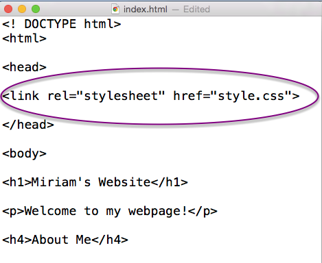
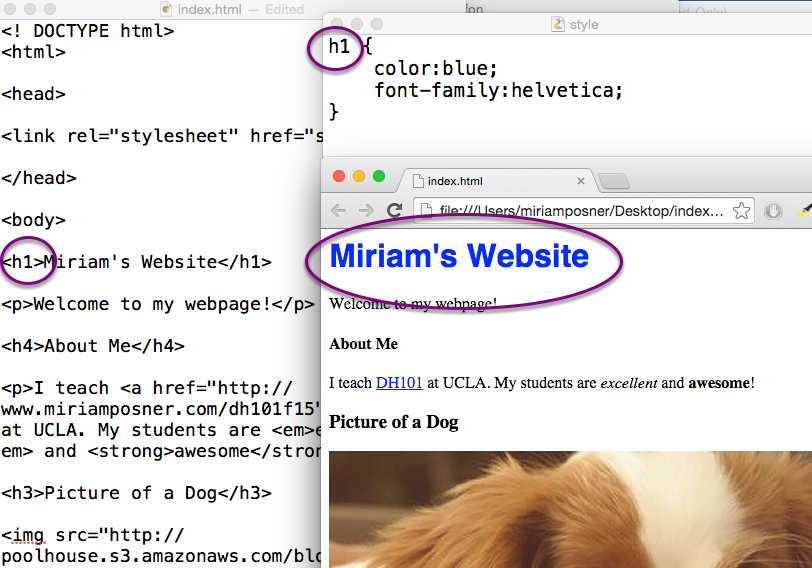
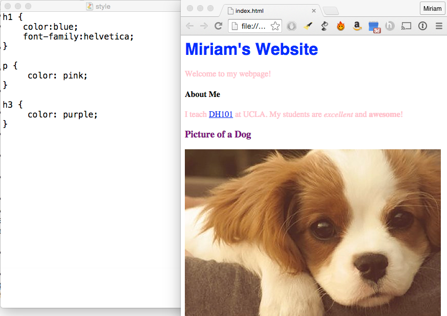
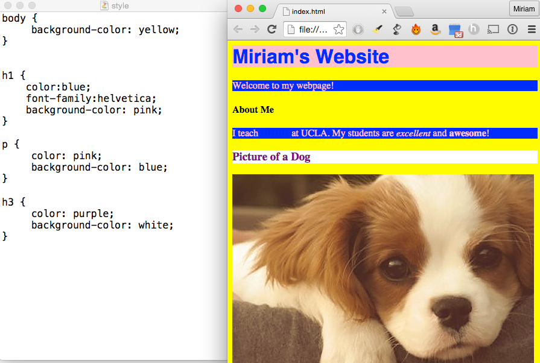
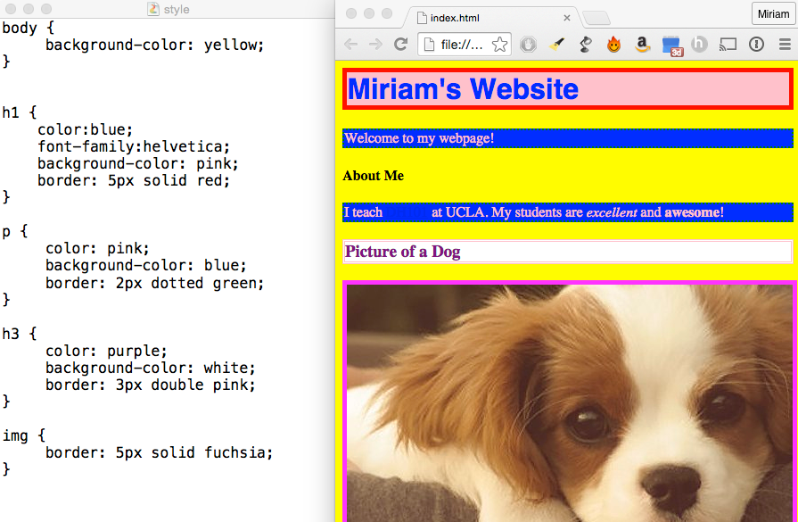
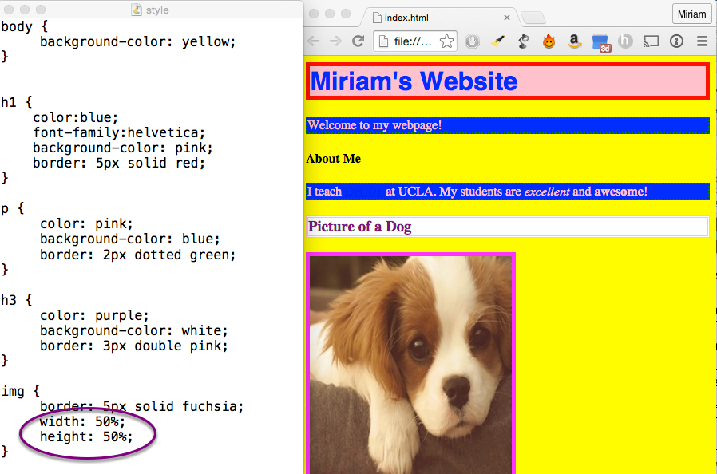
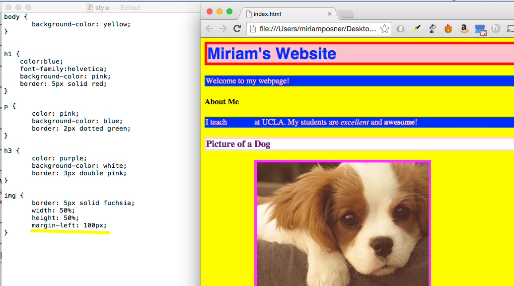
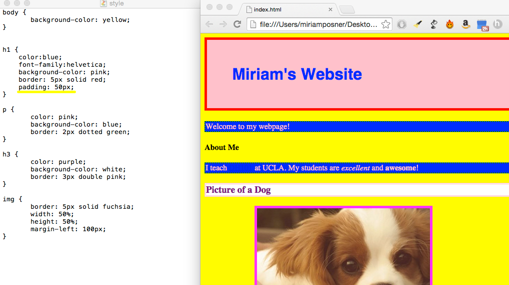

Paint That Page with CSS
========================

You've used HTML to build your webpage, but it doesn't have a lot of
style yet. Let's add some with **CSS**.

CSS stands for **cascading style sheet**, a somewhat confusing name for
a language that you use to format your page so that it looks just the
way you want. CSS can get super-complicated, but the basic principles
aren't hard to master.

Link your HTML document to a CSS document
-----------------------------------------

You can add CSS styles to your HTML document in a few different ways,
but I like to keep all of my CSS rules in a separate document. Open a
new text document (be sure it's **plain text format**) and save it in
the same place as your html document with the name **style.css**.

Now we have to tell the HTML document to look for the CSS document in
order to receive information about styles. Luckily, that's not too hard.
Inside the **&lt;head&gt;** tags on your html document, type

**&lt;link rel="stylesheet" href="style.css"&gt;**

Now you should be linked!

How CSS styles work
-------------------

The basic rule is that you specify the html tag you'd like your rule to
affect and then say what you want to do to the content inside the tag.
Then all of the content inside of that tag will be affected.

In the example above, I've specified that all of the content inside
**&lt;h1&gt;** tags should be made blue and transformed into the
Helvetica font. Notice that the content inside the paragraph tags isn't
affected. That's because the paragraphs are not inside the **h1** tags.

As you can see, your rules go inside angle brackets, which look like
this **{ }** and are separated by semicolons.

Make everything different colors!
---------------------------------

Everybody know that the more color a webpage has on it, the better it
is.

Change background colors
------------------------

To CSS, every element on your webpage forms a box. You can change the
background color of this box by using the background-color style rule.

As you can see above, even the body tag forms a box that contains
everything on the page. Who wants a boring background color? Make that
page stylish!

Add some borders
----------------

Since everything on your page is a box, you can add borders around
everything. Notice that I've also put a border around my dog photo by
using the **img** tag.

Do some resizing
----------------

You can change pretty much anything with CSS, including sizes. I want my
dog picture to be smaller, so I'm going to add some style rules for the
**img** tag.

I've chosen to use percentages, but you can also use pixels (50px).

Move things around
------------------

You can use CSS to move things around on the page. The most direct way
to do this is to change the **margins** (the space between the element
and whatever's next to it). I'm going to scooch my dog picture over to
the right by increasing its left margin. (See what happens when you try
**margin-right**, **margin-top**, and **margin-bottom**).

Add some padding
----------------

Margin is the space between an element and its neighboring elements.
**Padding** is the space between a piece of content and its borders.
Let's give the header some more padding to make it stand out. Looking
good!
