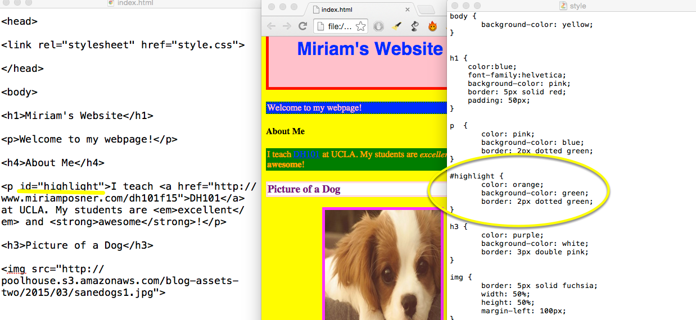
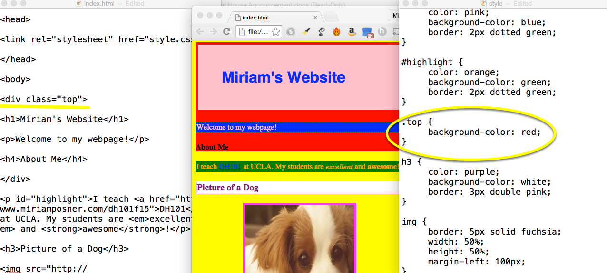
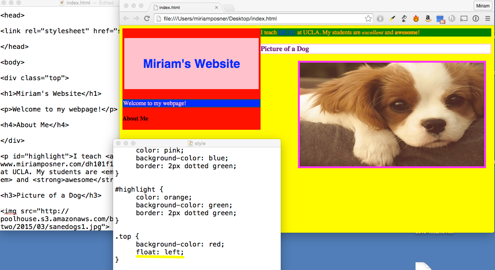
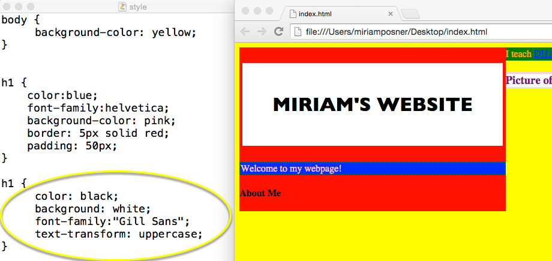
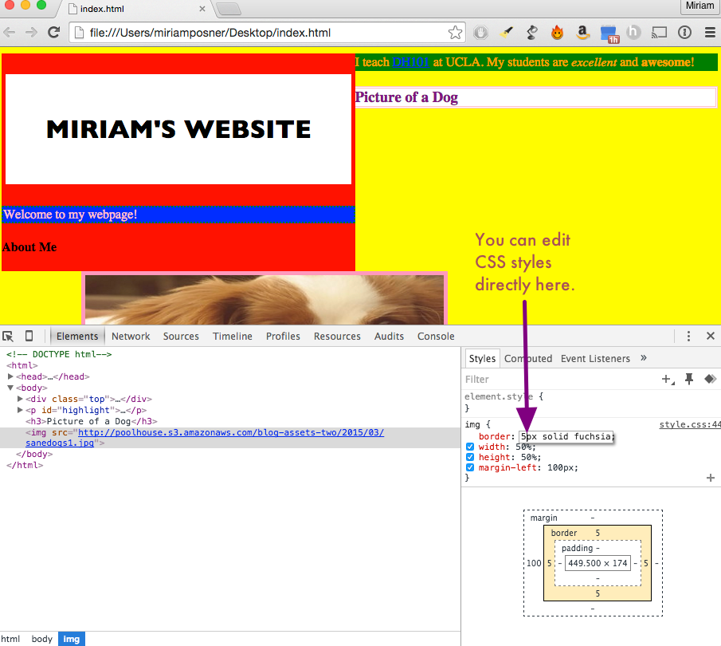

CSS Part Two: Divs, Classes, and IDs
====================================

We've learned how to use CSS styles to format content on our webpage,
and the code we've used is great for when you want to format *all*
paragraphs, headers, or images. But what happened if you want to, say,
distinguish among paragraphs on your page? Or break your page up into
sections? That's where divs, classes, and IDs come in handy.

Use IDs to distinguish among elements
-------------------------------------

I like the way my paragraphs look, but I want to create a special style
for paragraphs I want to highlight. I can do this by adding an **ID
tag** to those paragraphs. First, after the tag for the paragraph I want
to highlight, I type **id="highlight"**. Then I create a style for that
ID tag on my stylesheet by typing **\#highlight** and entering styling
information, just as I would for any element. The hashtag in front of
"highlight" tells the browser that it refers to an ID tag.

Notice that when I refresh the page, the first paragraph is treated as
before, since I haven't labeled it "highlight." The second paragraph,
because of its ID tag, looks different.

Divide your page into sections with divs
----------------------------------------

The last step works well when you want to style individual elements. But
what if you want to create sections on your page? **Div** tags come in
handy for that. A **div** create a new, invisible box around whatever
elements it encloses, allowing you to style these elements as one block.

To label divs, use a **class**, which is just a way of naming an
element. It's very similar to an ID tag, except classes refer to
elements that appear multiple times per page, while ID tags can be used
only once. (In practice, this distinction is pretty blurry, but that's
the idea.)

Create a new **div** around part of your page and give it a **class**.
Then style it on your stylesheet just as you did with the ID tag. The
only difference is that instead of placing the hashtag in front of the
div's class, you'll place a period in front of it, to indicate that it's
a class.

Get even crazier with floats
----------------------------

**Floats** can be kind of confusing, but the idea is that if you apply a
**float** to an element, it'll attempt to move in that direction,
pushing all of its neighbors to the side. Try it by floating one of your
divs left or right.

Taking precedence
-----------------

We're almost done, but there's one last thing it's important for you to
know. What happens if you have contradictory styling information on your
stylesheet? For example, what if you style your **h1**s one way at the
top and another way toward the bottom? Try it.

The later style takes precedence.

Your browser can help you out
-----------------------------

Right-click somewhere on your webpage and select **Inspect Element**.
You'll see something like the image above, which gives you information
about how that element is styled. (In this case, I've clicked on my dog
image.) You can actually style elements directly on the page by clicking
on the style information. It won't stick, though; the page will "reset"
as soon as you refresh it.
