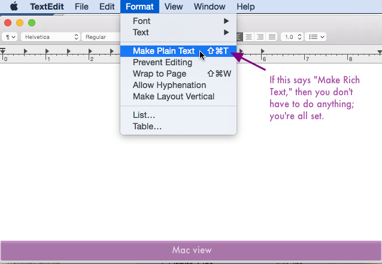
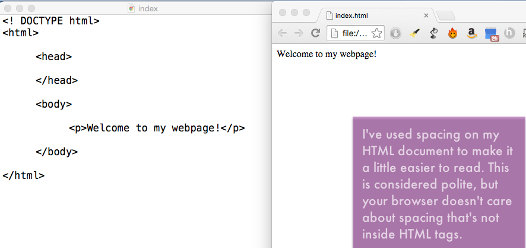
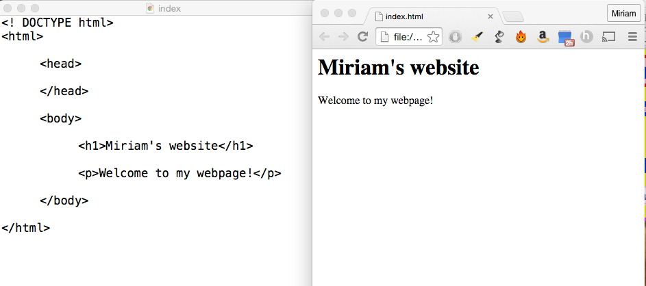
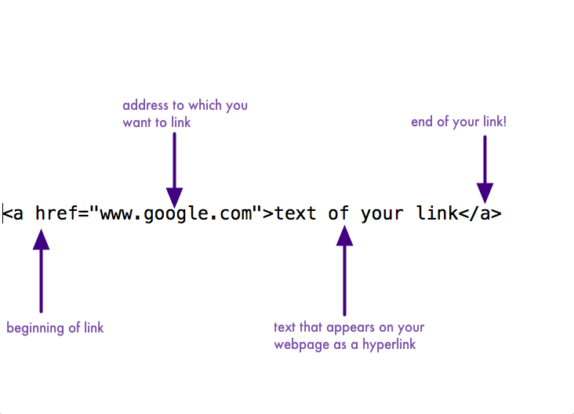
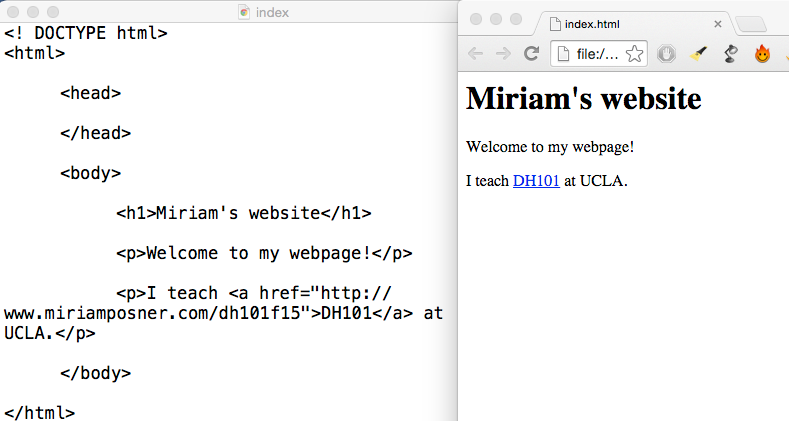
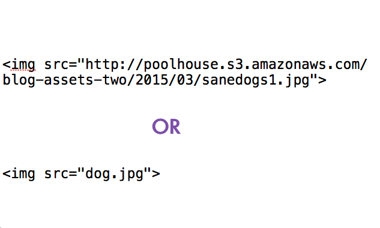
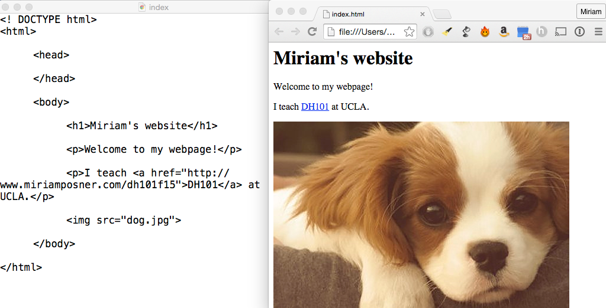
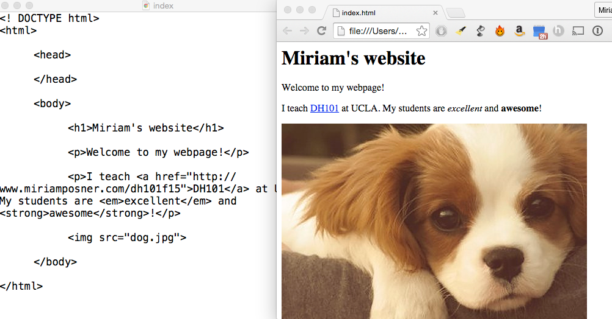
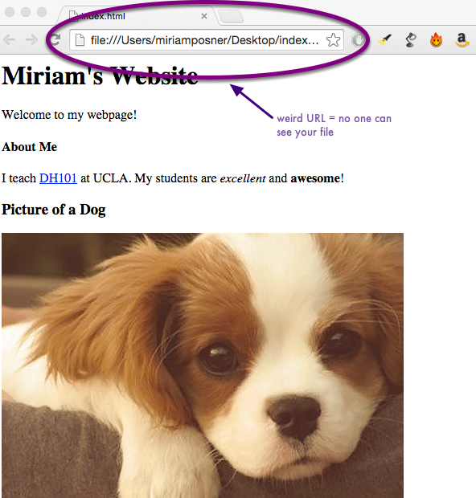

Build a webpage from scratch with HTML
======================================

HTML is the language that web browsers (like Firefox, Chrome, and
Safari) understand. It's a markup language, meaning you annotate content
with it so that the browser treats that content in different ways.

It's not too hard to learn, and it's fun!

Get set up
----------

**If you're on a Mac,** open up **TextEditor** and create a new blank
document. Click on the **Format** menu and click on **Make Plain Text**.
(If the menu says **Make Rich Text**, then you don't have to do
anything; you're already set!) Save the document as **index.html**.
Important: be sure it's being saved as a plain-text document, not a
rich-text document. And remember where you saved it!

**If you're on a PC**, open up **Notebook++** and create a new blank
document. Save it as **index.html**, and remember where you put it!

Believe it or not, a plain text editor (like Notebook) and a web browser
(like Chrome, Safari, or Firefox) are all you need to build even the
fanciest webpage!

Enter the document declaration and a little bit of text
-------------------------------------------------------

A **document declaration** gives instructions to the web browser (like
Safari or Firefox) for how to handle the document you've created.
Luckily, they're easy to make. Just type **&lt;!DOCTYPE html&gt;** at
the very top of the document.

Then press **return** and type in **&lt;html&gt;** to tell the browser
to expect HTML in the document that follows. Then skip a few lines and
close your html tag by typing **&lt;/html&gt;**. (Your browser doesn't
care about spaces and returns that aren't inside HTML tags.)

It's considered good practice to divide up your webpage into **head**
and **body** sections. Special instructions for the browser (if you have
any) go in the head section. Content goes in the body section.

To make these sections, press **return** and enter **&lt;head&gt;**.
Leave a line or two blank and close your head tag by typing
**&lt;/head&gt;**.

Now make the **body** section. Below your **&lt;head&gt;** tag, type
**&lt;body&gt;**. Then skip a few lines and type **&lt;/body&gt;**.

Let's put some text in, too, so we have something to look at. Type
**&lt;p&gt;Welcome to my webpage&lt;/p&gt;** after your opening body tag
and before the closing body tag. **Save** your document.

Leave your document open and navigate to where you saved the file.
Double-click the icon. By default, the file should open up in a browser.
Now you've opened the file in two different ways: as a webpage and as a
text file. Arrange your windows so you can see the document open as a
text document and as a webpage, simultaneously.

On your text document, alter the text between the paragraph tags so that
it says something different and **save** the document. Now click
**Refresh** on your web browser. The text on the webpage should show the
new text you've saved.

Add a header
------------

By default, headers instruct browsers to treat text inside differently,
to signal that it's important. Add a header to your page by putting some
text in **&lt;h1&gt;** tags, somewhere above your paragraph tags. Save
the document and refresh your browser. You should now have a header on
your page! Looking good.

You can also use **&lt;h2&gt;** tags, which are a bit smaller, and
**&lt;h3&gt;** tags, which are smaller still, all the way to
**&lt;h5&gt;** tags. Experiment with different-sized headers, saving and
refreshing as you go.

How links work
--------------

What's a webpage without a link? They work like this:

**&lt;a href="www.google.com"&gt;text of your link&lt;/a&gt;**

In the example above, **www.google.com** is the URL to which you want to
link and **text of your link** is the text that actually appears as a
hyperlink.

Create a link on your page
--------------------------

Try it yourself by creating a new paragraph (using the opening and
closing &lt;p&gt; tags) and creating a link in your new paragraph. Save
your document, refresh your browser and test your link!

How images work
---------------

You can link to an image in one of two ways. If there's an image out
there on the Web that you'd like to embed on your page, you can grab the
link to the image by right-clicking on the image and clicking **Copy
Image URL**. Then you can embed the image by pasting the link, as above.

If you have an image on your computer that you'd like to use, you can
save it **at the same place where your html file is saved** and link
directly to it by entering the file name, as above.

Add an image
------------

Add an image to your webpage using one of the two methods from the
previous step.

Add some emphasis
-----------------

Sometimes you want to highlight particular text on your page, to
indicate that the browser should treat it differently. Common tags for
this are **&lt;em&gt;** (which stands for **emphasis**; by default, your
browser will italicize the text inside this tag) and **&lt;strong&gt;**
(by default, your browser will bold the text inside this tag).

Create more text and experiment with emphasis and headers. Just remember
to always close those tags!

But wait! No one can see your page!
-----------------------------------

If you look closely at the URL on your webpage, you'll see that it looks
funny: it starts with **file:///**, not **http://**. That's because
you're working on your file **locally**, meaning just on your own
computer. No one else can see your webpage at the moment.

In order for other people to see your file, it has to be **hosted on a
server**, meaning moved to a special computer whose job is to broadcast
files to the internet. You don't have a server yet, but you will on
Friday. Francesca will show you how to purchase server space and move
your file to a server.
