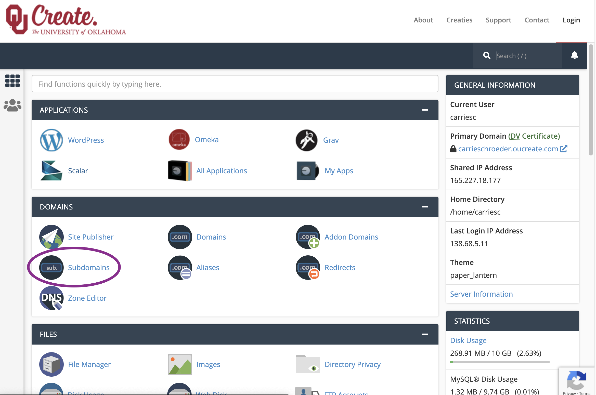
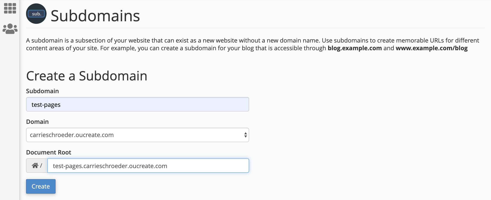
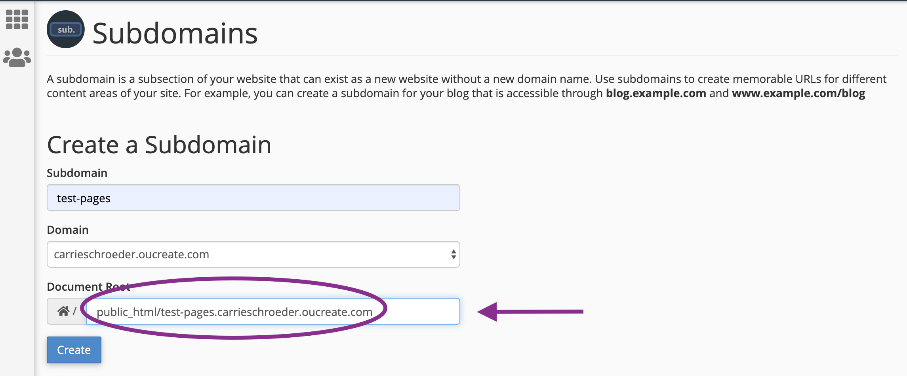
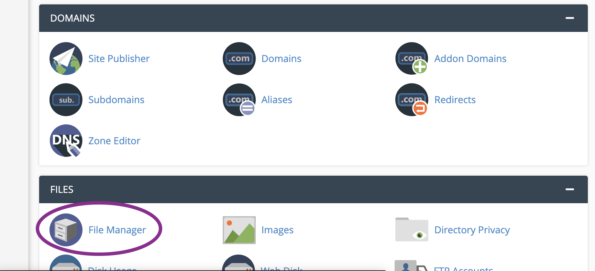
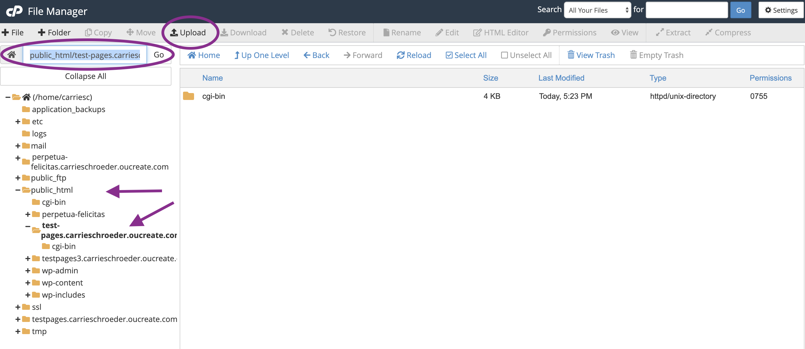

# Tutorial on Uploading your files to your server space at OU

This tutorial was created on 30-March-2020 for Caroline T. Schroeder's Intro to DH course at OU.

## About files and servers

For people to be able to see your files, such as your HTML files you created in [the HTML tutorial](https://github.com/ctschroeder/tutorials/blob/master/html_css_workshop/HTML_Tutorial.md), you need to put them on a server on the web. Fortunately, you have access to server space through the OU Create program. This tutorial will show you how to create a subdomain and put your files in a public folder for the world to see.

## 1. Create a Subdomain on your OU Create Account

We are going to create a separate space on your OU Create Account for these files.  We are going to keep them separate from your main website, so there is no confusion about which is your main blog/website and which is this sub-project. To do this, we'll create a subdomain. You've seen subdomains before -- the "dh2020" in the course website dh2020.carrieschroeder.net is a subdomain.  You can create more websites and projects on your domain by using subdomains.

First login at [OU Create](https://create.ou.edu/) as you always do. You will then see the control panel (CPanel) for your OU Create account

Look in the Domains section and click on Subdomains:

Pick a name for your subdomain. I'm making mine "test-pages".  

You'll see a box for your subdomain name. When I type test-pages into that box, OU Create automatically creates the "root" for your documents for that subdomain. Mine reads test-pages.carrieschroeder.oucreate.com . 

**We actually want to change that "Document root".**  We are going to tell the server where your files live that you want the files for this subdomain to go in your **public HTML** folder, so that the public can see your files!

To do this, put your cursor at the very beginning of the Document Root box and type public_html/ before the name of your subdomain. So on my computer, **I now see public_html/test-pages.carrieschroeder.oucreate.com** in the box for Document Root.

Click the button for Create. You should see a message that your subdomain has been created.

## 2. Navigate to the directory where you will upload your files

In the upper left, there should be a "Brady bunch" type symbol of nine boxes in a 3x3 square.  Click on that to get back to the main CPanel.

Scroll down under Files and click on File Manager.

You'll see an interface that looks a little like your finder or navigator on your computer with a bunch of folders on the left panel, and more files and folders in a larger panel on the right.

On the left, **look for the public_html folder**.  Click on it to open it -- you should see your subdomain folder there! I have a folder titled "test-pages.carrieschroeder.oucreate.com".  Click on your subdomain folder.  The files in that folder will appear on the right.  (It should be empty except for a cgi-bin folder.)

## 3. Upload your file(s) to your subdomain

Be sure you are in the right folder (also called a directory).  You should see the path for your directory in a little box above the left hand panel.

When you're in the correct directory, click on "Upload" on the top menu.

Upload ALL the files you need for your site.  Your index.html file, your image files, your CSS file, etc.  

Keep the same file structure.  I suggested in the HTML tutorial to make a new folder on your computer **purely** for these files. Upload everything in that folder (but not the folder itself).  If you if you have subfolders inside your project folder (say, a subfolder titled "images" for all your images for the project), be sure to upload those subfolders.  Upload everything to the server just as it is on your computer.

You should be able to drag and drop or select files to upload.  Add the files.

Now in the filemanager you should see all your files. Make sure they are all there. Make sure the file structure is ok! 

## 4. Visit your new website

Go to your subdomain!  So open your web browser.  Type in the URL for your subdomain (mine would be test-pages.carrieschroeder.oucreate.com).  You should see your site!  Congratulations!!!!

