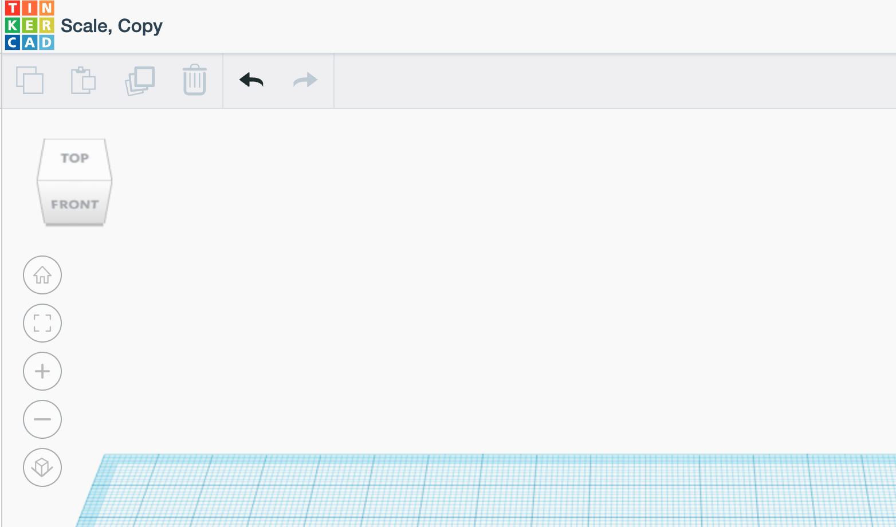
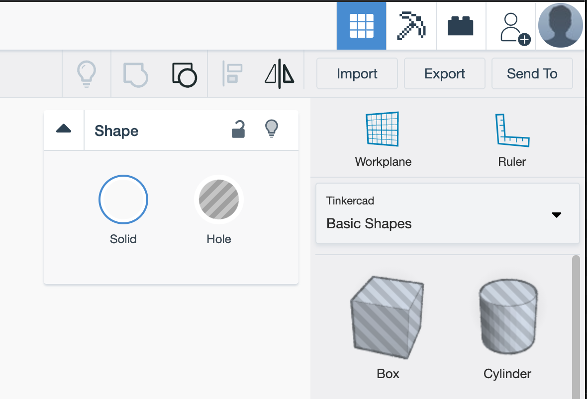
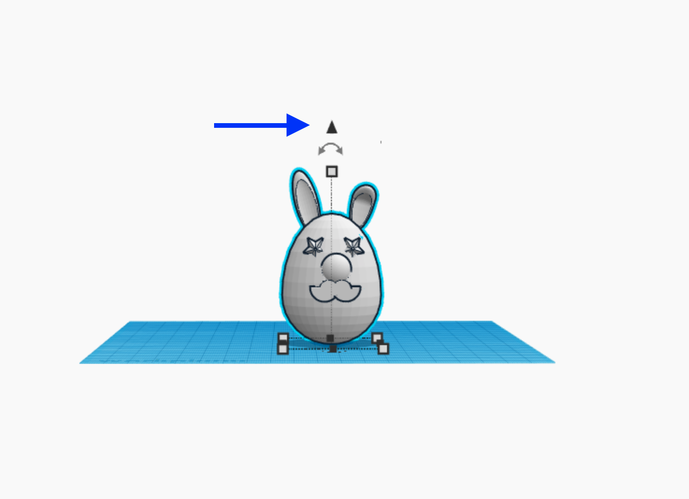
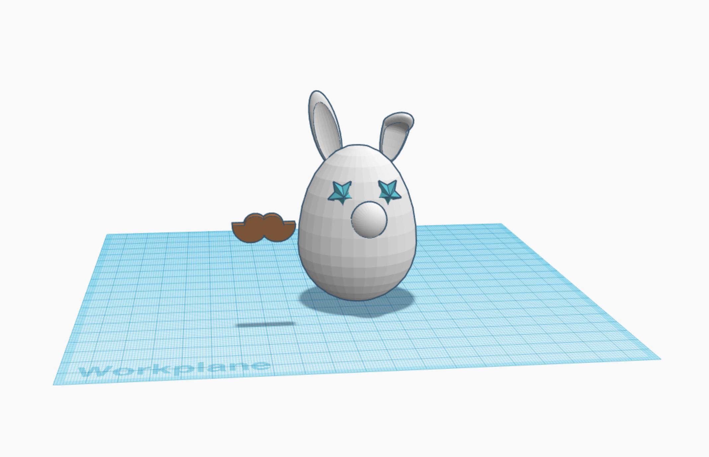
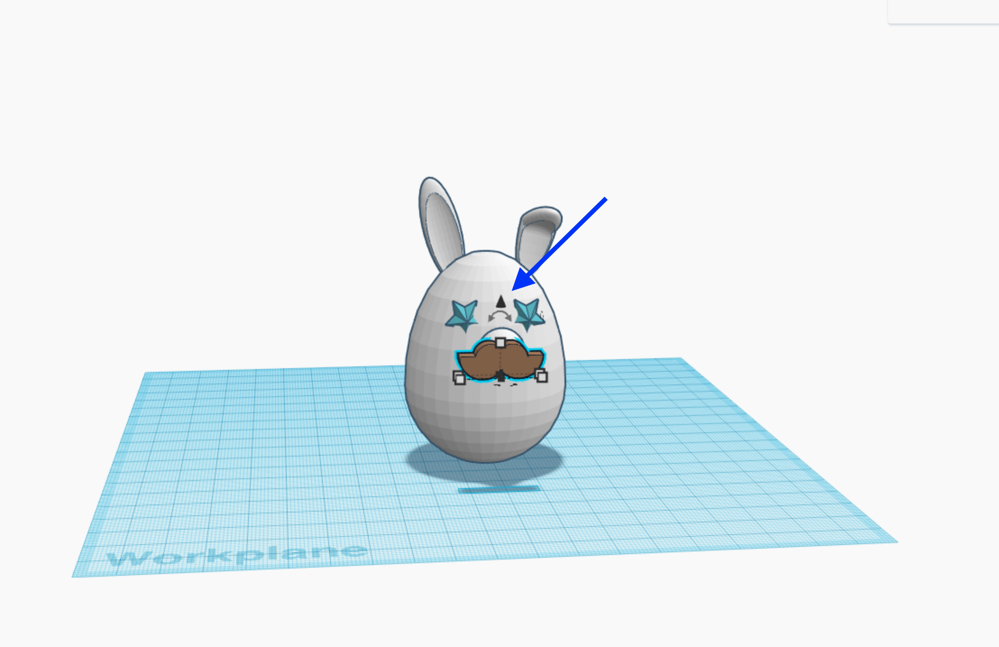
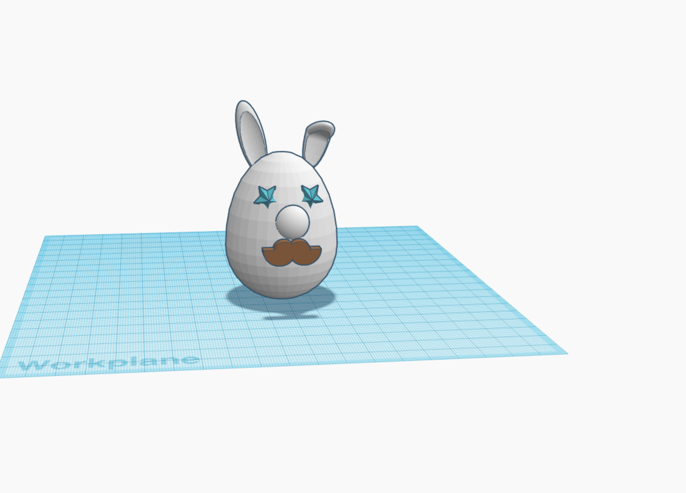
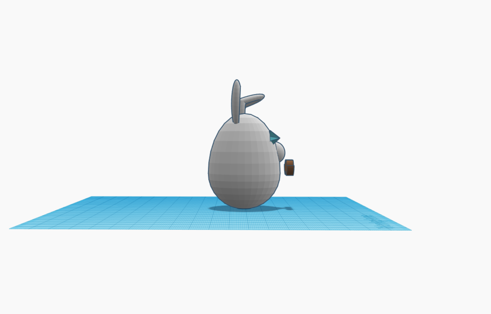
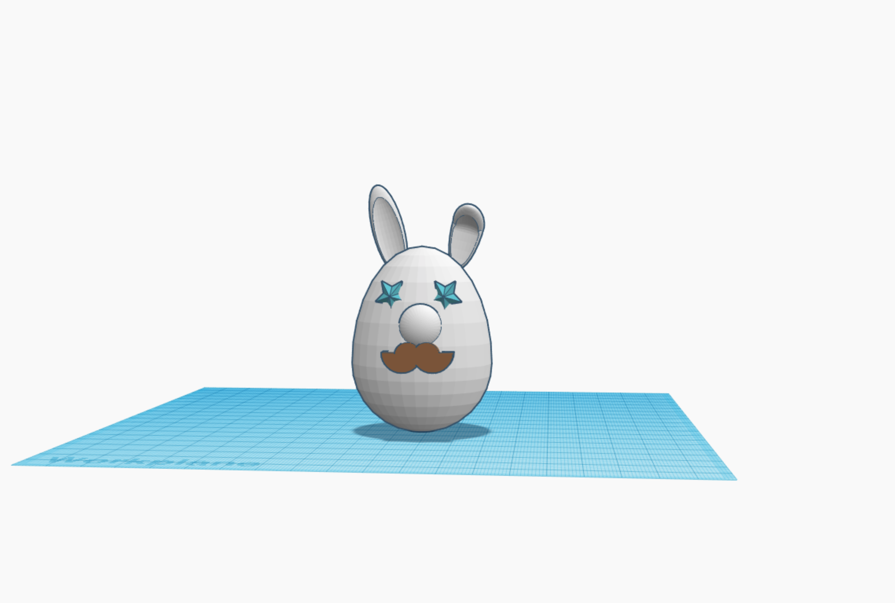
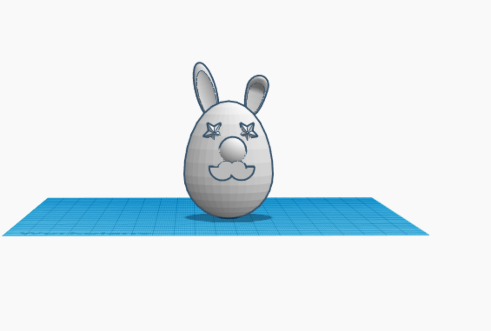

# Tutorial on Using Tinkercad for a Simple 3D Model

## About this tutorial

Created by Caroline T. Schroeder for Intro to DH at OU, Spring 2020. This tutorial lives online at https://github.com/ctschroeder/tutorials/blob/master/tinkercad.md

For this tutorial you will need consistent wifi access.

## About 3D Modeling

In this class we've studied 3D modeling for historical research, for archaeological research, for art history, and other academic research questions.  You also have experienced 3D modeling when you've seen digital movie sets or played video games with 3d environments. You might also use it to create art.  There are many tools to create your own 3d models. In this tutorial we will use Tinkercad because of its ease of use and extensive documentation.

## 1. Pick Something to Model

Pick an object around the house or find a photo of an ojbect you'd like to model.  Place that object near you as you work on your computer, someplace visible.

## 2. Create an Account and Complete Basic Tutorial on Tinkercad

Go to https://www.tinkercad.com/ and register an account by clicking on "Start Tinkering."  (Register as a student or individual but without a class - we have not created a "class" on the site.)

After filling out your information one one or two screens, you will see Welcome pop-up box asking "Ready to learn the moves?"  Click "Let's go!" to start the intro tutorial.

The basic Tinkercad work plane will appear with objects on it -- experiment with moving them around.  You'll see instructions on the left, and a dropdown "hint" if you get stuck.  A blue "next" button is on the bottom for the next step.

Go through all the steps for any one lesson in one go.  I recommend going through a few lessons up to the "Die on the Workplane" lesson. If you .  The "Die on the Workplane" one is a little trickier.  You can make basic shapes once you've done the Keychain.

It took me 15 minutes to do the tutorial through to the keychain. 25 for that and the die.

**Notes (Read these first):**
  - You can "undo" anything you mess up by clicking the left arrow in the top menu bar. You also can "undo" using the normal "undo" key combos on your computer (on a Mac it's usually command+z).
  
  

  
  - On the "Place Your Letters" section of the Key Ring tutorial, I couldn't change the snap grid setting--don't worry about it.
 
  - The top right menu bar has the group, ungroup, align, and mirror buttons. "Group" is the seamless square + circle; "ungroup" is to the right of "group" and looks like a circle on top of the square
  
    
  
When you finish the "Die on the Workplane" tutorial, the website takes you to a project page with lots of tutorials. You can do more or start in on your own project.

## 3. Your Tinkercad homepage

Click on the rainbow-block Tinkercad logo in the upper left to go to your account homepage.

To start a new model, click on "Create new Design."

To see your previous lessons, click on "Lessons" on the left hand menu.

To take more tutorials, click on "Learn" in the upper right. Then you'll see a page with three options: Starters, Lessons, Projects. 
  - "Starters" are basic skills tutorials.
  - "Lessons" are the tutorials like the ones we did; click on here to get a big page of models that will teach you skills while making something fun
  - "Projects" are more complex challenges
  
## 4. Start your model

GO to your TInkercad homepage by clicking on the rainbow-block logo in the upper left.

Click on Create New Design.  You'll see an empty workplane.

Use the skills you've learned to make a model of your chosen object!

You can be abstract -- using very basic block shapes.  Or you can try to be precise. It's up to you! 

Don't get hung up on perfection.  Remember you can use the Basic Shapes or toggle the menu to use letters/numbers or other characters.

## 5. Adding shapes to your basic shape.

You will need to move the CUBE in the upper left to see your model from different perspectives to see if the shapes you're putting ontop or next to each other are really in the right place. **Spin your model around to see if it looks right from all angles often**

You can use the LEFT, RIGHT arrows to move a shape l,r. 

If you need to move your shape  UP or DOWN click on the little black arrow on top of your shape to lift it up or down.

----

Below I'll show some steps for moving around and placing a shape on a shape.

Here I've got part of my bunny created.  I want to add a mustache, so I toggled the menu from Basic Shapes to Character, and I dropped the mustache on my plane. I used the black arrow to move it UP.  Now I need to move it right to get it to my bunny.

-----

Here I've clicked on the mustache to select it and then used the right arrow on my keyboard to get it over but it's still too high!  I will next click on the black triangle, hold, and drag the mustache down

-----

Hey, it looks pretty good here, right?

-----

Uh oh. 

I rotated that cube in the upper left to rotate my view, and I can see my mustache isn't really on my bunny. 

Now I'll click on the mustache and use the left arrow on my keyboard to move it left until it's on my bunny.

-----

After I put the mustache on the bunny, I've rotated the cube again to get the front view to see how it looks.

TADA the bunny looks good. 

-----

Now I will group the remaining shapes (eyes + mustache + head).

  - First I'll drag my cursor across the whole bunny to select all the shapes.
  - Then I'll click the "group" button on the top right menu bar (looks like square and circle seamlessley joined). ("Ungroup" is to the right -- the circle on top of the square.)
  
Now my model is ready!

## 6. Name your model

In the uper left, to the right of the logo, you'll see a random name for your model Tinkercad made up.  Click on it and rename.

## 7. Share your model

Please do three things to preserve your model:

1. Click on "EXPORT" in the upper right menu to download your model!  Save as .STL or .OBJ (or do it twice for both) to save your model to your computer.
2. For good measure, take a screenshot also.
3. Click on "SEND" in the upper right and copy the link to your model + email the link to ctschroeder@ou.edu 

Post to the blog
  - your screenshot
  - the link to your model you emailed me
  - a description of what it is
  - OPTIONAL: anything else you want to say about the experience

